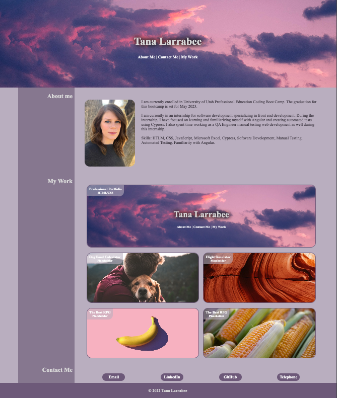

# Professional Portfolio

## Description

This project is Module 2 challenge of U of U's professional bootcamp. The portfolio is build to showcase a students work in the class, or any other project they would like a potential employer to view.
The portfolio is clean and user friendly, using concepts that have been taught in class up to this point including advanced CSS.

## Installation

N/A

## Usage

GitHub repository: https://github.com/Jonochi/professional-portfolio

GitHub Deployed Project Page: https://jonochi.github.io/professional-portfolio/

For students to maintain and send to potential employers and recruiters.

Project screenshot:
    

## Credits

N/A

## License

N/A
